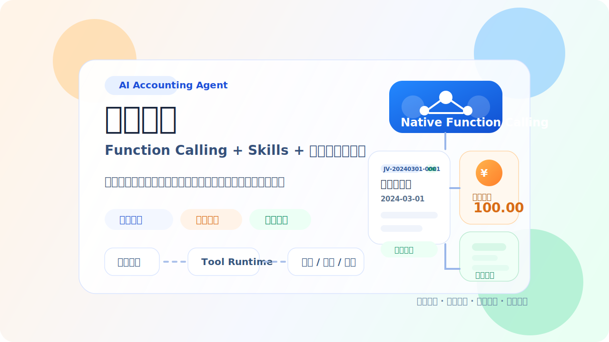

# 智能会计

<p align="center">
  
</p>

基于 LLM 的智能会计助手。当前版本采用按功能模块组织的单 Agent 架构，主链路为 `skills + native function calling + deterministic services`。

## 开发与架构来源

- **Claude Code**
- **Codex**
- **OpenCode**

## 功能

- **凭证记账**：把自然语言业务转换为标准会计凭证并入账
- **凭证查询**：按日期和状态检索历史凭证
- **税务计算**：支持小规模纳税人增值税、小型微利企业企业所得税基础测算
- **凭证审核**：支持金额异常、摘要质量、重复入账等规则审核
- **长期记忆与每日记忆**：支持显式写入、检索和召回
- **规则问答**：支持基于项目规则和会计约束的说明性问答

## 当前架构

```text
用户
  ↓
ConversationRouter
  ↓
ConversationService
  ↓
PromptContextService（.opencode/skills + 记忆 + 科目目录）
  ↓
ToolLoopService（原生 function calling）
  ↓
Feature Tool Routers
  ↓
Feature Services
  ↓
Repositories + SQLite / Markdown Memory
```

项目保留 OpenCode 风格的 `.opencode/skills/` 目录，并采用 `MEMORY.md + memory/YYYY-MM-DD.md` 的分层记忆形态。

## 项目结构

```text
├── main.py
├── app/                         # 启动与依赖装配
├── conversation/                # 会话编排、prompt 组装、tool loop
├── accounting/                  # 记账与凭证查询
├── tax/                         # 税务测算
├── audit/                       # 审核规则
├── memory/                      # 长期/每日记忆与搜索索引
├── rules/                       # 规则问答
├── llm/                         # LLM 仓储接口与 provider 实现
├── configuration/               # 配置读取与校验
├── .opencode/
│   └── skills/                  # Skills 入口
├── MEMORY.md                    # 长期记忆
├── memory/                      # 每日记忆（YYYY-MM-DD.md）
├── tests/
├── opencode.json
└── config.json
```

## 快速开始

### 1. 安装依赖

```bash
python -m venv .venv
source .venv/bin/activate
pip install -r requirements.txt
```

### 2. 配置

手动写入 `.env`：

```bash
LLM_API_KEY=your_key_here
```

并准备 `config.json`。

### 3. 运行

```bash
python main.py
```

## Native Function Calling

主流程不再依赖“模型输出 JSON，再由本地解析执行”的旧链路，而是强制走原生工具调用循环。当前工具包括：

- `record_voucher`
- `query_vouchers`
- `calculate_tax`
- `audit_voucher`
- `store_memory`
- `search_memory`
- `reply_with_rules`

第一轮必须调用至少一个工具；如果模型试图退回自由聊天，主流程会直接拒绝。

## Skills

Skills 位于 `.opencode/skills/<name>/SKILL.md`。
当前业务核心技能：

- `accounting`
- `tax`
- `audit`
- `memory`
- `rules`

辅助技能入口：

- `docx`
- `pdf`
- `pptx`
- `xlsx`

这些 skills 只负责提供领域上下文、工具使用约束和答复风格，不再承担“手写 JSON 协议”的职责。

## 记忆系统

- 长期记忆写入根目录 `MEMORY.md`
- 每日记忆写入 `memory/YYYY-MM-DD.md`
- Markdown 文件是源数据
- SQLite FTS 索引只负责搜索，不是主存储
- 记忆事实问题必须先通过 `search_memory` 查询，再生成最终答复

## 测试

```bash
./.venv/bin/python -B -m unittest discover -s tests -v
```

当前测试覆盖：

- 结构约束
- 记账与查账
- 税务计算
- 凭证审核
- 记忆写入与记忆召回
- 规则问答
- `<think>` 清理
- 禁止无工具自由聊天

## 说明

- 当前已通过本地 stub 测试
- 当前已通过真实模型的最小 smoke test，包括“记住 -> 召回”

## License

MIT
